# SPRING PLUS
작성자 : 김대훈

## 주요 구현 내용
- JPQL -> QueryDSL로 변경

- Spring Security 적용

- QueryDSL로 검색기능 만들기

- API가 성공하든 실패하든 해당 정보를 log로 남기기

- AWS RDS 적용

## 구현하지 못한 내용
- AWS S3 버킷 연결

- 대용량 데이터 처리

## POSTMAN API 테스트
1. 회원가입(일반)
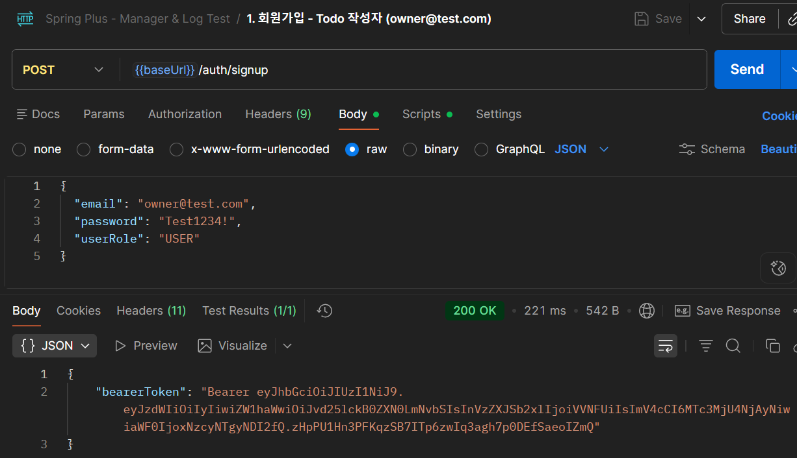
  
2. 로그인(일반)
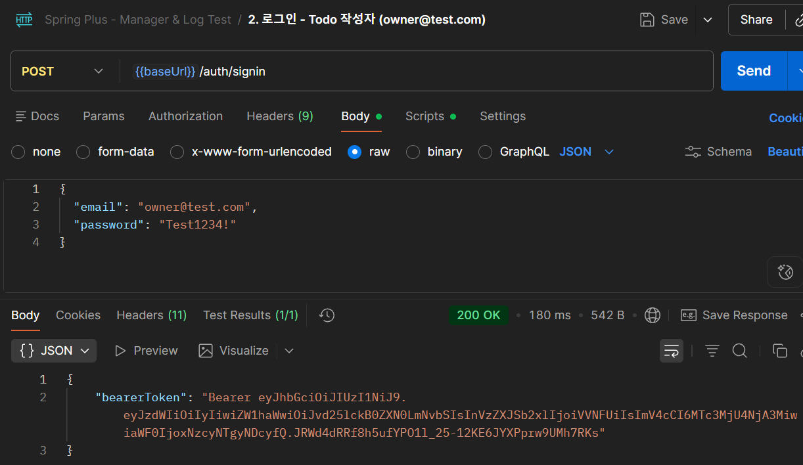
  

3. 회원가입(매니저)

<b> 

4. 로그인(매니저)
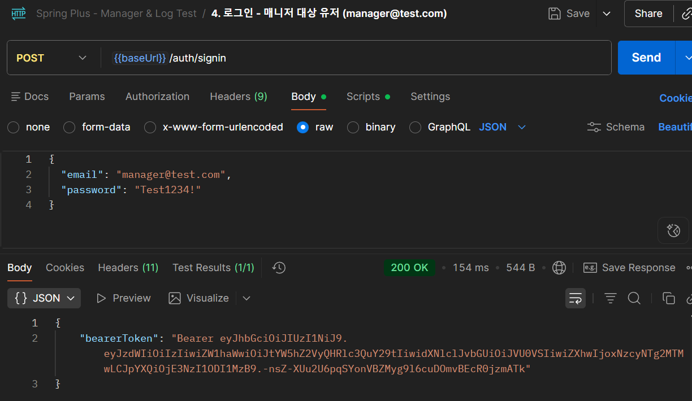
  

5. Todo 생성
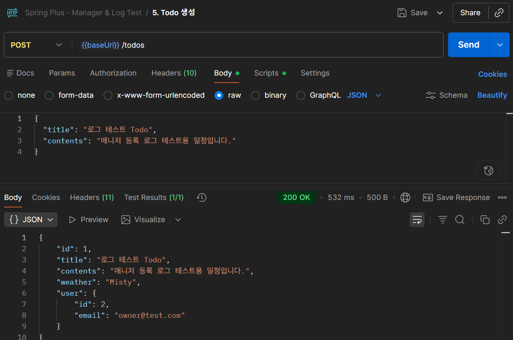
  

6. 매니저 등록 성공
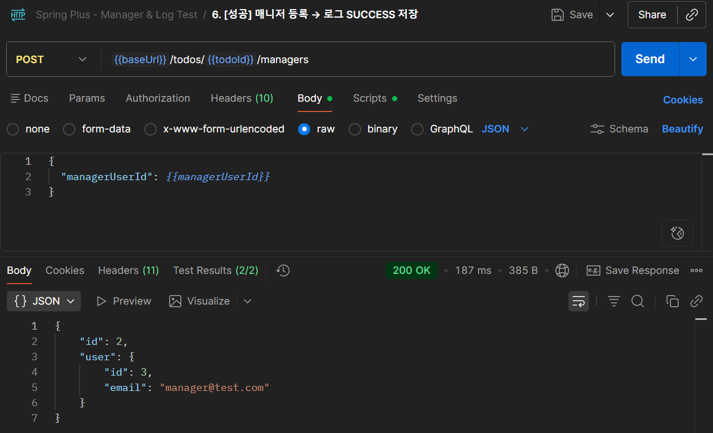
  

7. 매니저 등록 실패 - 존재하지 않는 유저
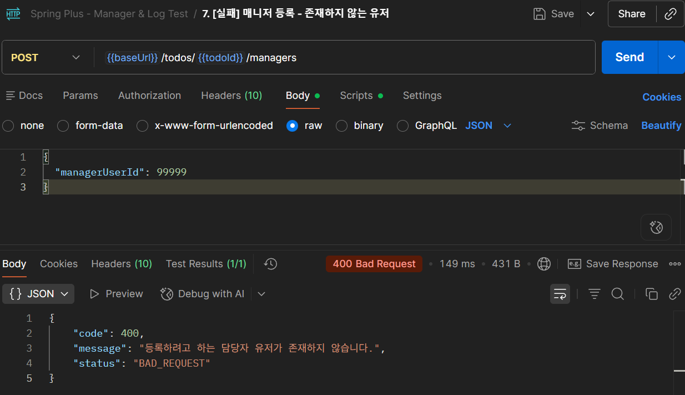
  

8. 매니저 등록 실패 - 권한이 없는 유저
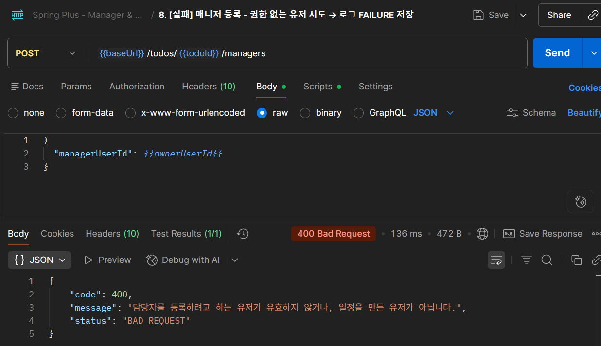
  

9. 매니저 목록 조회
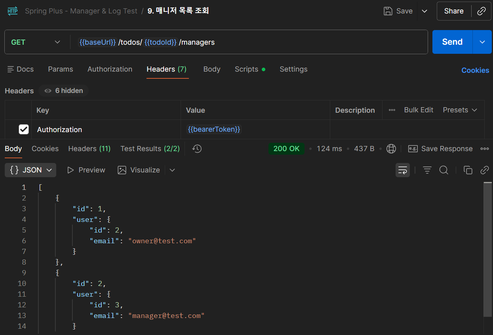
  

10. 매니저 삭제
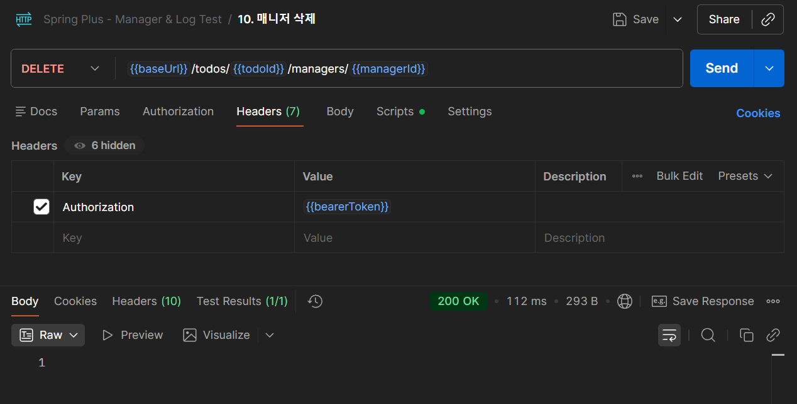
   

11. 8,9,10 후 LOG 테이블
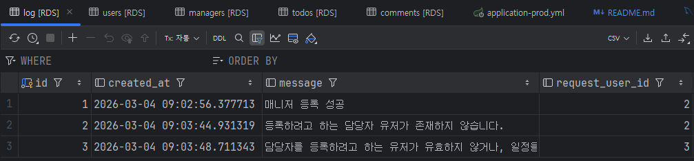

## AWS 활용  
### EC2

탄력적 IP 주소 설정

### RDS
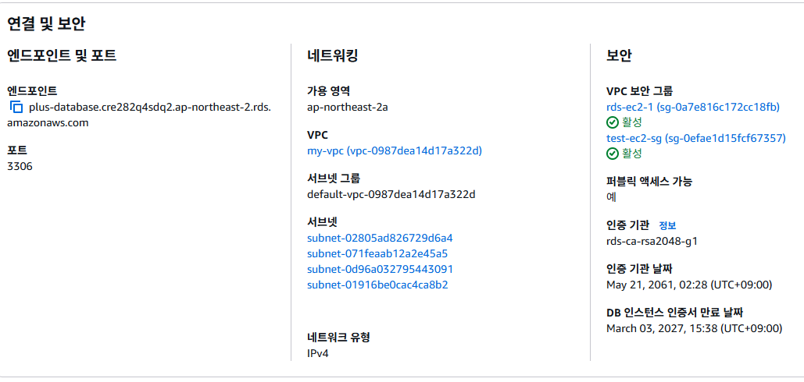
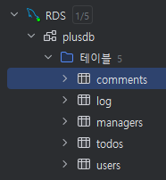

### 헬스 체크
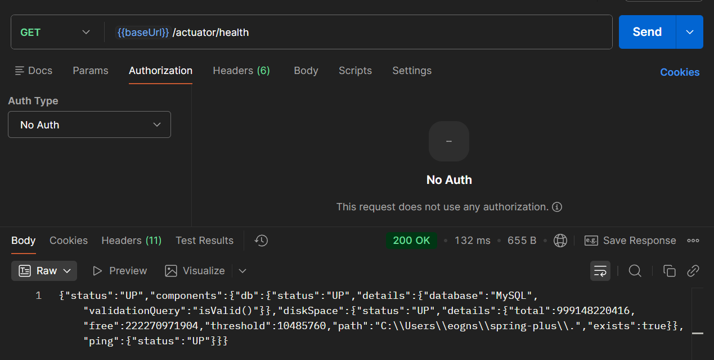